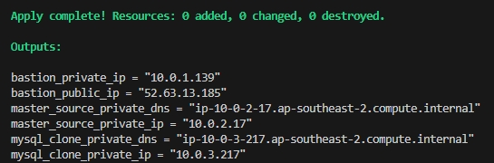

<!-- @format -->

Berikut adalah versi interaktif dan terstruktur dari dokumentasi proyek kamu, ditulis dalam gaya README GitHub yang profesional dan siap dipasang di repositori publik:

---

# ☁️ MySQL Replication Infrastructure with Terraform & Ansible

[](https://www.terraform.io/)
[](https://www.ansible.com/)
[](https://aws.amazon.com/)
[](https://ubuntu.com/)
[](https://www.php.net/)
[](https://www.nginx.com/)
[](https://www.phpmyadmin.net/)
[](https://www.mysql.com/)

---

## 📦 Overview

This project automates the **provisioning and configuration of a secure MySQL replication setup** using **Terraform** and **Ansible**, and includes a **GUI with phpMyAdmin** running via **Nginx** on a public-facing bastion host.

---

## 🧱 Infrastructure Layout

### 🔧 Terraform Provisions:

- **VPC** with public and private subnets
- **Internet Gateway** and **NAT Gateway**
- **Security Groups**:

  - Bastion: `port 22, 80` (restricted to your IP)
  - MySQL: `port 3306` from Bastion and internal CIDR (replication)

- **EC2 Instances**:

  - **Bastion Host** (public subnet with Elastic IP)
  - **MySQL Source** (private subnet)
  - **MySQL Clone** (private subnet)

---

## 🔁 Architecture & Access Flow

```
User -> Bastion (Nginx + phpMyAdmin) -> MySQL Master
                                     ↕
                                 MySQL Clone
```

- Bastion acts as a secure gateway and web interface
- phpMyAdmin reverse-proxied via Nginx on the Bastion
- Direct SSH/HTTP access to private MySQL nodes is blocked (private-only subnet)

---

## ⚙️ Ansible Configuration

### 🔐 Bastion Setup

- Install: **PHP**, **Nginx**, **phpMyAdmin**
- Configure `config.inc.php` to connect both **MySQL Master** and **Clone**
- Serve phpMyAdmin on: `http://<bastion_ip>/phpmyadmin`

### 🛢️ MySQL Nodes (Source & Clone)

- Install **MySQL Server**
- Configure:

  - `server-id`, `log_bin`, `bind-address = 0.0.0.0`
  - Allow connections from Bastion's private IP
  - Configure replication with `CHANGE MASTER TO`

---

## 🧠 Best Practices & Recommendation

✅ **Separate Roles**:

| Role            | Description              |
| --------------- | ------------------------ |
| Bastion Host    | SSH Access Only (secure) |
| phpMyAdmin Host | GUI Proxy via Nginx      |

Split phpMyAdmin and Bastion host into different instances for **modular security** and **clean role separation**.

---

## 🧪 Deployment Flow

### Terraform

```bash
cd terraform
terraform init
terraform apply
```

### Ansible

1. Update `inventory.ini` or `inventory/production/hosts.yml` with Terraform outputs:

```ini
[bastion]
<BASTION_PUBLIC_IP> ansible_user=ubuntu

[mysql_master]
10.0.2.X ansible_user=ubuntu

[mysql_clone]
10.0.3.X ansible_user=ubuntu
```

2. Run:

```bash
ansible-playbook -i inventory.ini site.yml
```

---

## 📤 Terraform Output

```bash
bastion_public_ip = "52.63.xxx.xxx"
mysql_source_private_ip = "10.0.2.xxx"
mysql_clone_private_ip  = "10.0.3.xxx"
```



Use these to configure **Ansible inventories** and **phpMyAdmin MySQL targets**.

---

## 📚 Example Files

- `terraform/` – VPC, EC2, Subnets, SG
- `ansible/roles/mysql_replication` – Install + Setup Replication
- `docs/` – \[Add diagram.png of architecture here]

---

## 🧠 Author & Credits

Created by \[XrerXrerX] – DevOps Engineer & Full Stack Developer
Specializing in automated cloud deployments & database reliability.

---

Let me know if you'd like me to generate an **SVG infrastructure diagram** based on your Terraform config.
